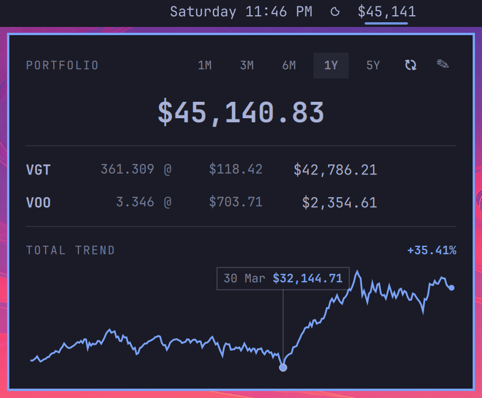

<div align="center">

# omarchy-portfolio-plugin

**A portfolio value & trend tracker for the Omarchy bar.**

Track your stocks, ETFs, and index funds right from your status bar —
total value at a glance, per-holding breakdown, and a live trend chart.

[](https://omarchy.org)
[](https://quickshell.outfoxxed.me)
[](LICENSE)

</div>

---

<div align="center">
  
</div>

## Features

- **Bar pill** — shows your total portfolio value, auto-sizing like the clock widget
- **Popup panel** — full holdings list with shares, price, and value per position
- **Trend chart** — total portfolio trend by default; click any holding to focus its chart
- **Range picker** — 1M / 3M / 6M / 1Y / 5Y (weekly candles keep 5Y light)
- **Hover readout** — crosshair with date and value at the nearest data point
- **Inline editing** — add, update, and remove holdings without leaving the panel
- **Smart caching** — prices cached 5 min, charts 60 min, so reopening never flashes
- **No API keys** — data comes from Yahoo Finance's public endpoints
- **Theme aware** — inherits your Omarchy theme colors automatically

## Requirements

- [Omarchy](https://omarchy.org) with the Quickshell-based shell
- `curl` (already included with Omarchy)
- An internet connection

## Install

```bash
omarchy plugin add https://github.com/softroni/omarchy-portfolio-plugin --enable
```

Then add it to your bar layout in `~/.config/omarchy/shell.json`:

```jsonc
{
  "bar": {
    "layout": {
      "center": [
        { "id": "softroni.portfolio", "refreshMinutes": 30 }
      ]
    }
  }
}
```

> `refreshMinutes` controls how often prices refresh in the background
> (default `30`). The shell hot-reloads `shell.json`, so changes apply instantly.

## Usage

Click the bar pill to open the panel.

| Action | How |
|---|---|
| Add a holding | Click the **✎** edit button, enter ticker + shares, press Enter |
| Update a holding | In edit mode, click its row, change the values, click **Update** |
| Remove a holding | In edit mode, click the **✕** next to the row |
| Focus one holding's trend | Click its row (outside edit mode); click again to return to total |
| Change chart range | Use the **1M–5Y** buttons in the header |
| Hover detail | Move the mouse over the chart for date + value |
| Force refresh | Middle-click the bar pill or hit the ↻ button |

### Keyboard

| Key | Action |
|---|---|
| `Enter` | Confirm field / save holding |
| `Escape` | Close panel or exit edit mode |

### IPC

Control the plugin from scripts or keybindings:

```bash
omarchy-shell softroni.portfolio toggle
```

Available actions: `open`, `close`, `show`, `hide`, `toggle`, `refresh`, `edit`.

## Holdings file

Holdings persist in plain JSON at:

```bash
~/.local/state/omarchy/settings/portfolio.json
```

```json
{
  "holdings": [
    { "ticker": "VOO", "shares": 12.5 },
    { "ticker": "AAPL", "shares": 40 }
  ]
}
```

You can also edit this file directly — changes are hot-reloaded.
Tickers use Yahoo Finance symbols (`VOO`, `AAPL`, `VWCE.DE`, `BTC-USD`, …).

## FAQ

**Is my financial data sent anywhere?**
No. Holdings stay on your machine; only standard ticker quote requests go to Yahoo Finance. No accounts, no telemetry.

**Does it support crypto or non-US tickers?**
Anything with a Yahoo Finance symbol works — e.g. `BTC-USD`, `ETH-USD`, `VWCE.DE`, `0P0001ABCD.F`.

**The chart says "No trend data".**
Usually a network hiccup at startup — it retries automatically up to three times, or force-refresh with middle-click.

## License

[MIT](LICENSE) © Softroni LLC
